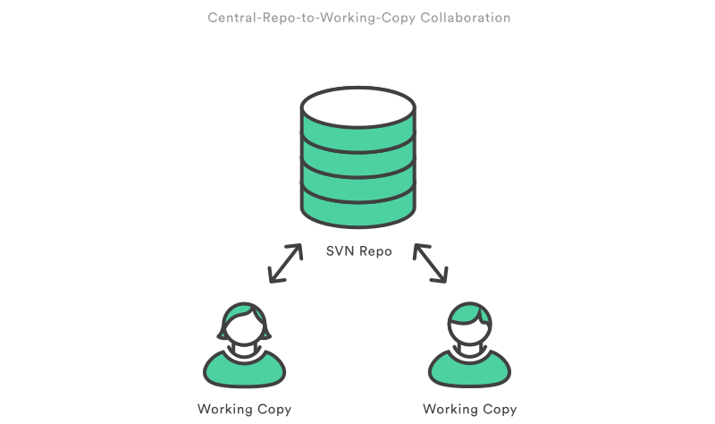

.. _blah:

The blah, blah, blah part
*************************

What's Git?
==========
 `Git history +10 years <https://www.atlassian.com/git/articles/10-years-of-git/>`_

Git vs SVN
==========

Snapshots, Not Differences
--------------------------

.. image:: _static/svn-git.svg

Distribuido vs Centralizado
---------------------------

.. image:: _static/distributed.svg

The 3 States of a File
======================

.. image:: _static/states.png

Working tree (Modified)
-----------------------

Index (Staged)
--------------

HEAD (Commited)
---------------

.. image:: _static/areas.png

Tree structure
==============

