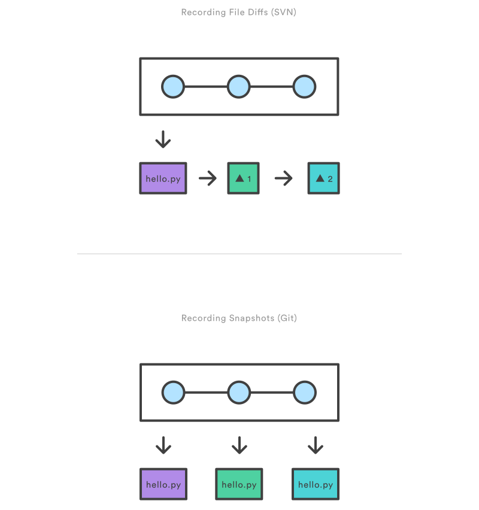

.. _tldr:

Important bits
**************

What's Git?
===========

Git
  A mild pejorative with origins in British English for an unpleasant, silly, incompetent, stupid, annoying, senile, elderly or childish person.

 `Git history +10 years <https://www.atlassian.com/git/articles/10-years-of-git/>`_

Git vs SVN
==========

Snapshots, Not Differences
--------------------------

Distributed vs Centrilized
---------------------------

.. image:: _static/centralized.svg
.. image:: _static/distributed.svg

The 3 States of a File
======================

.. image:: _static/states.png

Working tree (Modified)
-----------------------

Indicates what files have been changed.

Index (Staged)
--------------

Marks changed files/lines to be committed (Saved into database)

HEAD (Commited)
---------------
Safely stored and indexed within the local database.

.. image:: _static/areas.png

Initialize a reposotiry
=======================

Init
----

Creates an empty Git repository or reinitialize an existing one. This command creates an empty Git repository - basically a .git directory with subdirectories for objects, refs/heads, refs/tags, and template files.

Running git init in an existing repository is safe. It will not overwrite things that are already there.

.. code-block:: bash

  $ git init

Clone
-----

Clones a repository into a new directory with the same name as the repository beign cloned.

.. code-block:: bash

  $ git clone <REPO URL>

Cloning a repository into a directory with a custom name.

.. code-block:: bash

  $ git clone <REPO URL> <DIRECTORY NAME>

Configuration
=============

Get and set repository or global options

.. code-block:: bash

    $ git config --list

    $ git config --global user.name "Full Name"
    $ git config --global user.email email@email.com

Remotes
=======

Reference to the project that is hosted on the internet or network somewhere. Necessary to collaborate and can be many as pleased.

Adding a remote
---------------

Manage the set of repositories ("remotes") whose branches you track.

.. code-block:: bash

  $ git remote add origin <Repository URL>
  $ git remote add origin https://github.com/<USER>/<REPO NAME>.git

Working directory, Index & HEAD
===============================

Modifying files
---------------

Every time a file is modified it is marked as changed, and added to the **working directory** (automatically).

.. code-block:: bash

  $ touch new_file.txt
  $ git status
  Initial commit

  Untracked files:
    (use "git add <file>..." to include in what will be committed)

      new_file.txt

    nothing added to commit but untracked files present (use "git add" to track)

Accepting changes (Into the staging area)
-----------------------------------------

This command updates the **index** using the current content found in the **working tree**, to prepare the content **staged** for the next commit.

.. code-block:: bash

  $ git add new_file.txt
  $ git status
  On branch master

  Initial commit

  Changes to be committed:
    (use "git rm --cached <file>..." to unstage)

      new file:   new_file.txt

The file is now in **index** (staging area). Let's make another change.

.. code-block:: bash

  $ echo "This is a test" > new_file.txt
  $ git status
  On branch master

  Initial commit

  Changes to be committed:
    (use "git rm --cached <file>..." to unstage)

      new file:   new_file.txt

  Changes not staged for commit:
    (use "git add <file>..." to update what will be committed)
    (use "git checkout -- <file>..." to discard changes in working directory)

       modified:   new_file.txt

Untracked files
^^^^^^^^^^^^^^^

.. code-block:: bash

  On branch master
  Your branch is up-to-date with 'origin/master'.
  Changes to be committed:
    (use "git reset HEAD <file>..." to unstage)

      new file:   source/basics.rst

  Changes not staged for commit:
    (use "git add/rm <file>..." to update what will be committed)
    (use "git checkout -- <file>..." to discard changes in working directory)

      deleted:    source/easy.rst
      deleted:    source/hard.rst
      modified:   source/index.rst
      deleted:    source/noteasy.rst

  Untracked files:
    (use "git add <file>..." to include in what will be committed)

      .DS_Store

Visualizing differences (Working tree vs Staging area)
------------------------------------------------------

We have two changes on the same file. One staged and the other on the working three.

Let's see their differences.

On the Index (Staging area)
^^^^^^^^^^^^^^^^^^^^^^^^^^^

.. code-block:: bash

  $ git diff --cached
  diff --git a/new_file.txt b/new_file.txt
  new file mode 100644
  index 0000000..e69de29

On the Working tree
^^^^^^^^^^^^^^^^^^^

.. code-block:: bash

  $ git diff
  diff --git a/new_file.txt b/new_file.txt
  index e69de29..0527e6b 100644
  --- a/new_file.txt
  +++ b/new_file.txt
  @@ -0,0 +1 @@
  +This is a test

Applying changes (Commiting)
----------------------------

Stores the current contents of the **index** in a new commit along with a log message from the user describing the changes.

.. code-block:: bash

  $ git commit -m "Added new file"

History (Log)
=============

Shows the commit logs.

.. code-block:: bash

  $ git log
   commit 911d366873ec0df5ffed8531176e94c0ceadf7f8
   Author: Dave Rivera <daverivera90@gmail.com>
   Date:   Wed Nov 25 10:20:39 2015 -0500

       Added new file

Back to the past (Resetting)
============================

The way to reset a file may vary according to the state of the file.

Reset working directory
-----------------------

``checkout`` switch branches or restores working tree files.

.. code-block:: bash

  $ git checkout -- new_file.txt

Removing from the stage area
----------------------------

``reset`` resets current HEAD to the specified state

.. code-block:: bash

  $ git status
  On branch master
  Changes not staged for commit:
    (use "git add <file>..." to update what will be committed)
    (use "git checkout -- <file>..." to discard changes in working directory)

        modified:   new_file.txt

    no changes added to commit (use "git add" and/or "git commit -a")

  $ git add new_file.txt
  $ git status

  On branch master
  Changes to be committed:
    (use "git reset HEAD <file>..." to unstage)

      modified:   new_file.txt

  $ git reset new_file.txt
  Unstaged changes after reset:
  M new_file.txt
  $ git status
  On branch master
  Changes not staged for commit:
    (use "git add <file>..." to update what will be committed)
    (use "git checkout -- <file>..." to discard changes in working directory)

      modified:   new_file.txt

    no changes added to commit (use "git add" and/or "git commit -a")

Collaboration
=============

.. image:: _static/collaboration.svg

Fetching
--------

``fetch`` Downloads the objects and refs from another repository.

.. code-block:: bash

  $ git fetch

Pulling
-------

``pull`` Fetches from origin and integrates with another repository or a local branch

.. code-block:: bash

  $ git pull origin master

Pushing
-------

.. code-block:: bash

  $ git push origin master

Branching
=========

.. image:: _static/branches.svg

A branch represents an independent line of development. It maintains an specific state of the files.

This facilitate the process of ``editing``/``staging``/``committing`` discussed before. New commits are recorded in the history for the current branch.

The ``git branch`` set of commands allows to create, delete, list or rename branches. Although it doesn't allow to switch between branches.

Create branches
---------------

.. code-block:: bash

  $ git branch <Branch Name>

Move among branches
-------------------

.. code-block:: bash

  $ git checkout <Branch Name>

Delete branches
---------------

.. code-block:: bash

  $ git branch -d <Branch Name>

Pushing branches
----------------

.. code-block:: bash

  $ git push origin <Branch Name>

Delete remote branches
----------------------

.. code-block:: bash

  $ git push origin :<Branch Name>

Merging branches
----------------

.. image:: _static/merge.png

.. code-block:: bash

  $ git merge <Branch Name>

